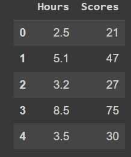
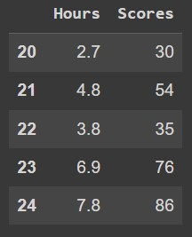
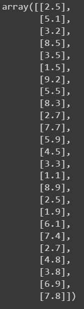
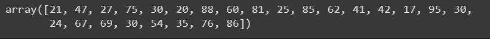
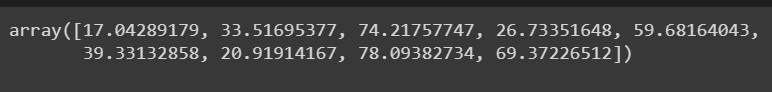
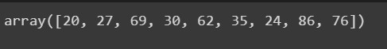
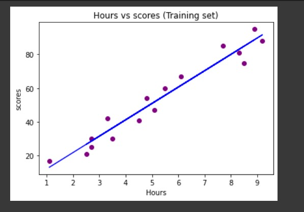
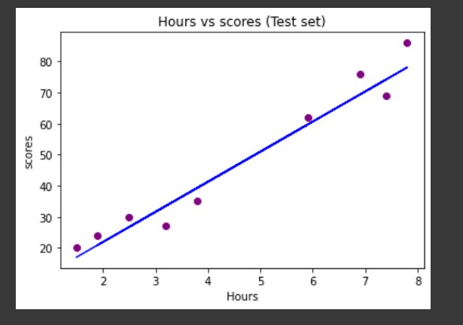
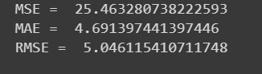

# Implementation-of-Simple-Linear-Regression-Model-for-Predicting-the-Marks-Scored

## AIM:
To write a program to predict the marks scored by a student using the simple linear regression model.

## Equipments Required:
1. Hardware – PCs
2. Anaconda – Python 3.7 Installation / Jupyter notebook

## Algorithm
1. Use the standard libraries in python for Gradient Design.
2. Upload the dataset and check any null value using .isnull() function.
3. Declare the default values for linear regression.
4. Calculate the loss usinng Mean Square Error.
5. Predict the value of y.
6. Plot the graph respect to hours and scores using scatter plot function.


## Program:
```
/*
Program to implement the simple linear regression model for predicting the marks scored.
Developed by: 212224040109
RegisterNumber:  HARSHINI.V
*/
import pandas as pd
import numpy as np
import matplotlib.pyplot as plt
from sklearn.metrics import mean_absolute_error,mean_squared_error
df=pd.read_csv('student_scores.csv')
df.head()

df.tail()

X=df.iloc[:,:-1].values
X

Y=df.iloc[:,1].values
Y

from sklearn.model_selection import train_test_split
X_train,X_test,Y_train,Y_test=train_test_split(X,Y,test_size=1/3,random_state=0)

from sklearn.linear_model import LinearRegression
regressor=LinearRegression()
regressor.fit(X_train,Y_train)
Y_pred=regressor.predict(X_test)
 
Y_pred

Y_test

plt.scatter(X_train,Y_train,color="orange")
plt.plot(X_train,regressor.predict(X_train),color="red")
plt.title("Hours vs Scores(Training Set)")
plt.xlabel("Hours")
plt.ylabel("Scores")
plt.show()

plt.scatter(X_test,Y_test,color="purple")
plt.plot(X_test,regressor.predict(X_test),color="blue")
plt.title("Hours vs Scores(Training Set)")
plt.xlabel("Hours")
plt.ylabel("Scores")
plt.show()

mse=mean_squared_error(Y_test,Y_pred)
print('MSE = ',mse)
mae=mean_absolute_error(Y_test,Y_pred)
print('MAE = ',mae)
rmse=np.sqrt(mse)
print("RMSE = ",rmse)
```

## Output:
## df.head():

## df.tail():

## x values:

## y values:

## y_pred:

## y_test:

## Graph of training data:

## Graph of test data:

## Values of MSE, MAE, RMSE:



## Result:
Thus the program to implement the simple linear regression model for predicting the marks scored is written and verified using python programming.
